# deep-high-resolution-net.TensorFlow
An TensorFlow implementation of HRNet-32.The dataset used to train the model is the AI Challenger dataset. 

Just for fun! A **famous actor** CXK in China and the keypoints estimated using the HRNet-32

 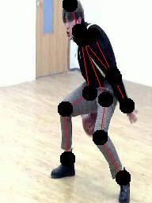 

For more details, please refer to the  [paper](https://arxiv.org/abs/1902.09212) and the [dataset](https://challenger.ai/competition/keypoint).

# Environment
- python 3.6
- TensorFlow 1.11
- PyCharm

# How to Use
##### For Training
- Download the AI Challenger dataset.
- Convert the images in the AI Challenger dataset (train_images folder) to TFRecords by running the dataset.py. Please make sure that the **dataset_root_path** you used in the **extract_people_from_dataset()** function is the path of the AI Challenger dataset you saved in the previous step.
- Run the train.py!

Please note that the structure of the HRNet is complicated. I trained the HRNet-32 network using 2 Nvidia Titan V graphics cards. As the limited of the graphics memory（16 GB）, the max batch size I used is 2, and it took around 30 hours to finish 1 epoch (189176 steps). The model files were not uploaded. Please email me if you need them.

##### For Testing
- Finish the 4 steps in the training.
- Make sure the dataset name, mode file name is corrected.
- Run the test.py!

The result images will be saved in the _test_img_ folder. It will also generate the distances.npy and the classes.npy file, which will be used to calculate the AP50 and AP75 in later. 

##### For Evaluating
- Run the evaluate.py.

It will print the AP50 and AP75 information in the command line.

# What You Will See
### For Training
- The loss information.
- The examples of images predicted by the network will be saved into the _./demo_img/_ folder.

Epoch Number | example image 1 | example image 2 | example image 3 | example image 4
:-: | :-: | :-: | :-: | :-:
epoch 0| 
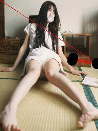
 | 

 | 
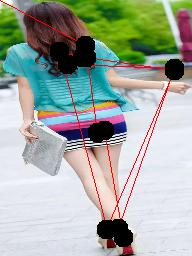
 | 
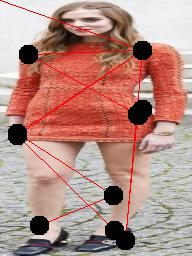
| 
epoch 1| 

 | 

 | 
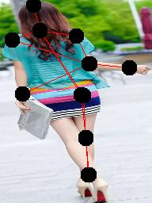
 | 
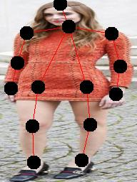
| 
epoch 2| 
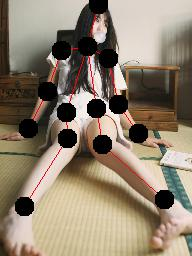
 | 
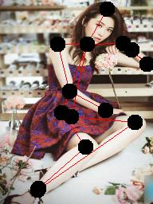
 | 

 | 

| 
epoch 3| 
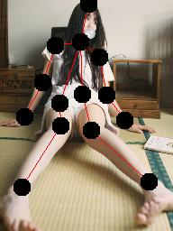
 | 

 | 
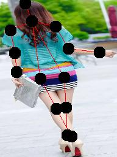
 | 

| 

### For Testing
- The result of testing images will be saved into the _./test_img/_ floder.

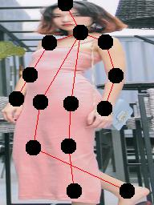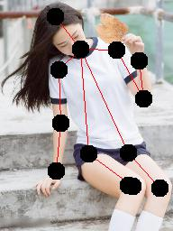

# For More
Contact me: vxallset@outlook.com
